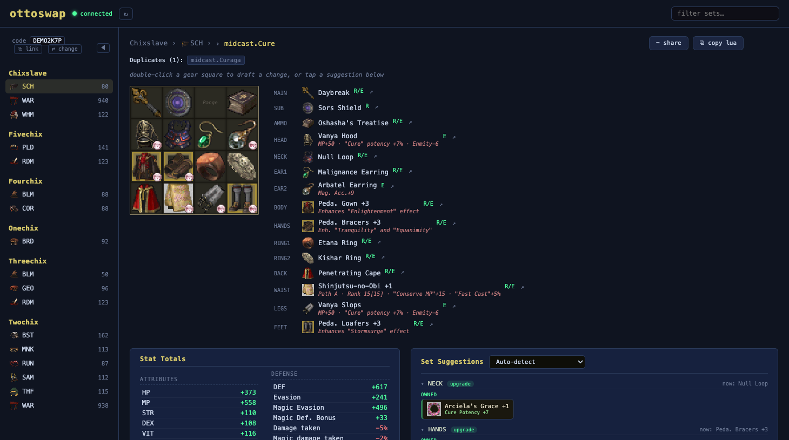
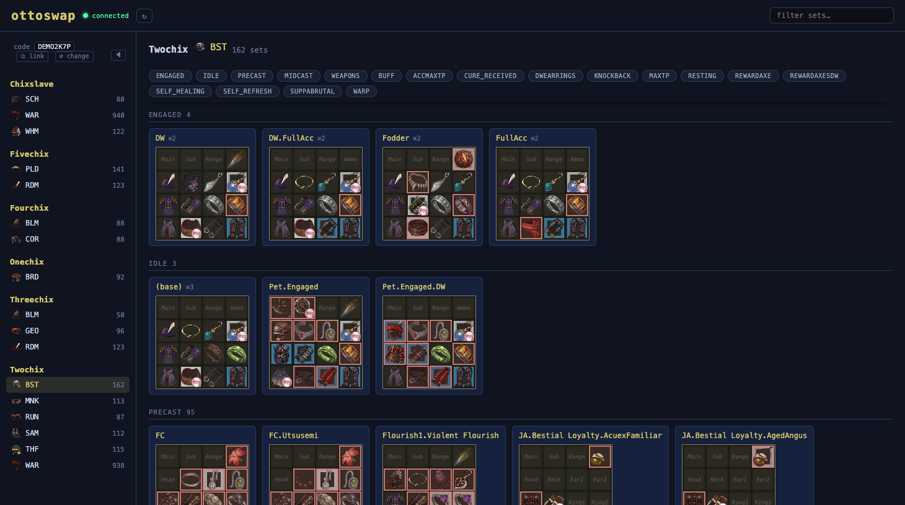

# ottoswap-bridge

A thin [Windower](https://www.windower.net/) addon that connects FFXI to
**[ottoswap](https://ottoswap.ckmtools.dev)** — share, browse, and analyze your GearSwap sets.

It reads your GearSwap sets (your whole `addons/GearSwap/data` tree), your live equipped
gear, and the equippable items you own, and sends them to ottoswap so the website can show
and analyze your sets. All the analysis runs in your browser; this addon is just the pipe.

  
   
  <em>Open any set to see its stat totals and get upgrade suggestions from gear you already own — augments and all.</em>

  
   
  <em>Every set across all your characters and jobs, in one place.</em>

## What it shares

ottoswap-bridge syncs your GearSwap data with ottoswap, keyed to a pairing code you control.
It's open source — one short file
([`ottoswap-bridge/ottoswap-bridge.lua`](ottoswap-bridge/ottoswap-bridge.lua)) you can read.

What it handles: your GearSwap data files, your equipped gear, the items in your equippable
bags (inventory/wardrobes), and your base stats/skills.

## Install

1. Copy the `ottoswap-bridge` folder into your `Windower/addons` directory.
2. In game: `//lua load ottoswap-bridge`
3. Get a pairing code from [ottoswap.ckmtools.dev](https://ottoswap.ckmtools.dev) and run:
   `//ottoswap setup <pairing-code>`

To load it automatically, add `lua load ottoswap-bridge` to your Windower `scripts/init.txt`.

## Commands

| Command | Description |
|---|---|
| `//ottoswap setup <code>` | Pair with the website using a code from ottoswap |
| `//ottoswap code` | Show your pairing code + a link to pair another device |
| `//ottoswap push` | Push your current gear now |
| `//ottoswap status` | Show pairing status (incl. your code) |
| `//ottoswap endpoint <url>` | Override the relay endpoint (advanced) |

Your pairing **persists across sessions** — set up once and the bridge keeps pushing while
you play. Forgot your code? Run `//ottoswap code`, or open
`your-ottoswap-code.txt` in the addon folder. The pairing code works on **any device or
network** — open the link it gives you on your phone/laptop to pair it there too.

## Requirements

Windower 4 — a standard install already includes the LuaSec and LuaSocket libraries the bridge uses.

## Status

Live and in active development. The site ([ottoswap.ckmtools.dev](https://ottoswap.ckmtools.dev))
browses and analyzes your sets today — stat totals, owned-gear upgrade suggestions, augment
decoding, and set sharing via link. The relay runs on `ottoswapapi.ckmtools.dev`. New features
are still landing regularly.

## Issues & feedback

Hit a bug or have a request? Please [open a GitHub issue](https://github.com/christopherkmoore/ottoswap-bridge/issues).

## Support

ottoswap is free. If it saves you time, you can **[♥ chip in for the server costs](https://buy.stripe.com/dRm14n03odnj3DV4hGf7i0a)** — pay what you want, no account needed. Totally optional.

## License

MIT — see [LICENSE](LICENSE).
